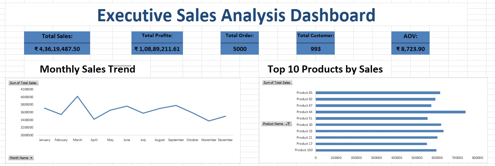

# 📊 Executive Sales Analytics Dashboard

## 📷 Dashboard Preview

---

# 📌 Project Overview

This project is an interactive Executive Sales Analytics Dashboard built in Microsoft Excel using Power Pivot, DAX, Pivot Tables, Pivot Charts, and Slicers.

The dashboard helps business users monitor sales performance, profit, customers, products, regions, and salespersons through interactive visualizations.

---

# 🎯 Business Objectives

- Track Total Sales
- Monitor Total Profit
- Analyze Monthly Sales Trend
- Identify Top 10 Products
- Compare Sales by Category
- Evaluate Region Performance
- Identify Top Salespersons

---

# 🛠 Tools & Technologies

- Microsoft Excel
- Power Pivot
- DAX
- Pivot Tables
- Pivot Charts
- Slicers
- Data Modeling

---

# 📈 Dashboard KPIs

- Total Sales
- Total Profit
- Total Orders
- Total Customers
- Average Order Value (AOV)

---

# 📊 Dashboard Visualizations

- Monthly Sales Trend
- Top 10 Products by Sales
- Sales by Category
- Region Performance
- Top 10 Salespersons

---

# 📂 Project Files

- Dashboard.xlsm
- Dashboard_1.jpeg
- Dashboard_2.jpeg

---

# 💡 Skills Demonstrated

- Data Cleaning
- Data Modeling
- Power Pivot
- DAX Measures
- Pivot Tables
- Dashboard Design
- Data Visualization
- Business Intelligence

---

# 🚀 Future Improvements

- Power BI Version
- SQL Integration
- Python Data Analysis
- Interactive Forecasting

---

# 👨‍💻 Author

**Ashish Yadav**

Aspiring Data Analyst

GitHub: https://github.com/Ashishyadav739
